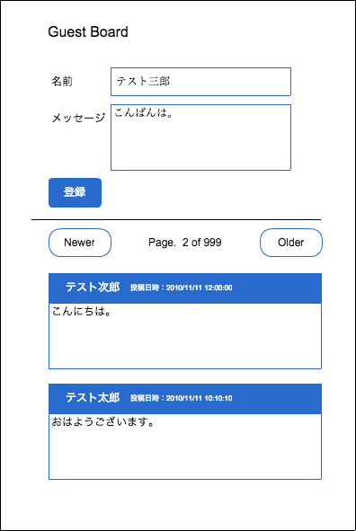

===============================================================================
設計しよう
===============================================================================

アプリケーションを作る前に、まず設計を行わなければいけません。

設計する上で重要なのは「作るアプリケーションのイメージを明確にすること」と

「可能な限りデータを明確にしておくこと」です。

.. warning::

   今回紹介する手法はあくまで一例です。

   機会があれば、色々な人にどのように設計を行っているか質問してみてください。

   より貴方にあった設計手法が見つかるかもしれません。

画面のスケッチを書こう
===============================================================================

今回作るアプリケーションは、ゲストボードです。ゲストボードに必要な機能は以下の通りです。

- このWebサイトを訪れた人がコメントを残す事ができる
- 過去に投稿されたメッセージを見ることができる

これらを満たす画面のスケッチは以下のとおりです。

スケッチとあわせて、画面上の入力項目（テキストボックスやチェックボックスなど）や操作できる項目（ボタンやリンク）がわかるようなメモも書きましょう。

**画面上段**

.. list-table::
   :widths: 2 2 3 4
   :header-rows: 1

   * - 項目名
     - スケッチ上の表示
     - フォームタイプ
     - 備考
   * - 画面タイトル
     - Guest Board
     - \-
     -
   * - 名前
     - テスト三郎
     - text
     -
   * - メッセージ
     - こんばんは。
     - textarea
     -
   * - 登録ボタン
     - 登録
     - submit
     -

**画面下段**

.. list-table::
   :widths: 4 3 2 4
   :header-rows: 1

   * - 項目名
     - スケッチ上の表示
     - フォームタイプ
     - 備考
   * - ページ送りボタン(1)
     - Newer
     - Link
     - 新しい投稿が表示されるページへ遷移する
   * - ページ情報
     - Page. 2 of 999
     - \-
     - 現在のページ番号と全ページ数を表示する
   * - ページ送りボタン(2)
     - Older
     - Link
     - 古い投稿が表示されるページへ遷移する
   * - 投稿リスト - 名前
     - テスト次郎
     - \-
     - 投稿された名前を表示する
   * - 投稿リスト - 投稿日時
     - 2010/11/11 12:00:00
     - \-
     - 投稿された日時を表示する
   * - 投稿リスト - メッセージ
     - メッセージ
     - \-
     - 投稿されたメッセージを表示する

.. note::

   投稿画面と表示画面を分ける人、投稿フォームを下に持っていく人もいると思います。

   デザインによって実装も変わってくるので、色々なデザインのゲストボードを作ってみて下さい。

テーブル設計を考えよう
===============================================================================

スケッチの右側に赤字で書いてあるのが、データベースに保存する、またはデータベースから読み込んで表示するデータです。

ゲストボードでは「名前」と「メッセージ」は投稿者に入力してもらいますが、投稿日時については投稿者に入力してもらうのはおかしいので、システムで付与することにします。

これらの情報から設計したテーブルは以下のとおりです。

-------------------------------------------------------------------------------
テーブル
-------------------------------------------------------------------------------

.. list-table::
   :header-rows: 1
   :widths: 1 1

   * - 論理名
     - 物理名
   * - 投稿テーブル
     - posting

-------------------------------------------------------------------------------
列
-------------------------------------------------------------------------------

.. list-table::
   :header-rows: 1
   :widths: 2 2 2 1 1 1 2 3 3

   * - 論理名
     - 物理名
     - データ型
     - 長さ
     - 必須
     - キー
     - 外部キー
     - デフォルト値
     - 備考
   * - ID
     - id
     - INT
     -
     - YES
     - PK
     -
     -
     - AUTO INCREMENT
   * - 名前
     - name
     - varchar
     - 64
     - YES
     -
     -
     -
     -
   * - メッセージ
     - message
     - varchar
     - 255
     - YES
     -
     -
     -
     -
   * - 投稿日時
     - created_at
     - datetime
     -
     - YES
     -
     -
     - 登録した日時
     -

これらの情報を元に、ゲストボードを開発していきましょう。
