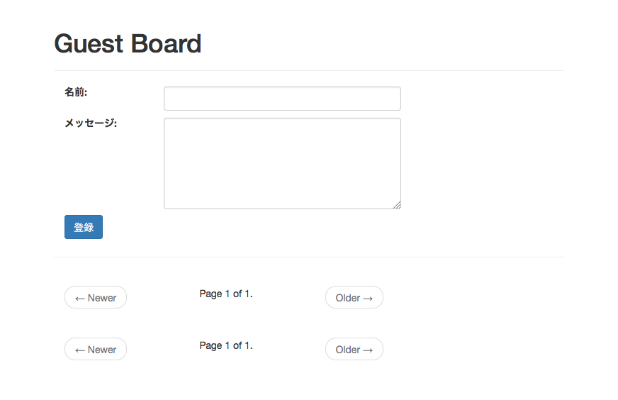
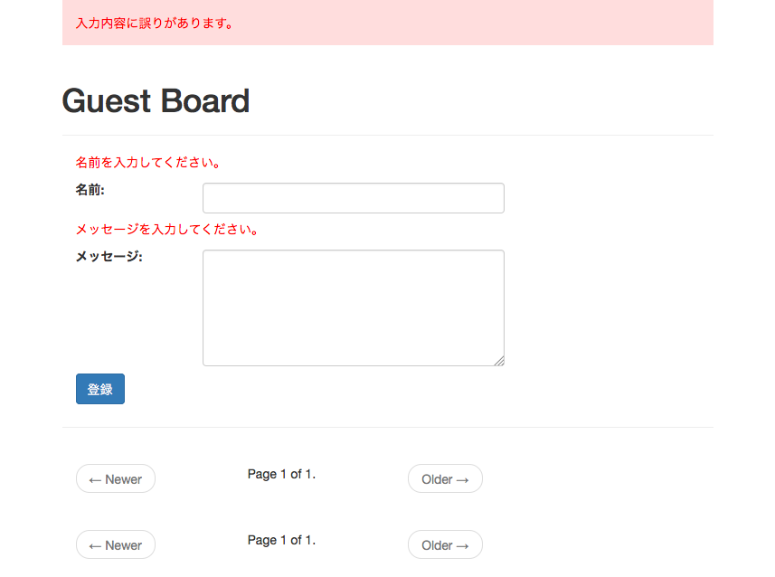
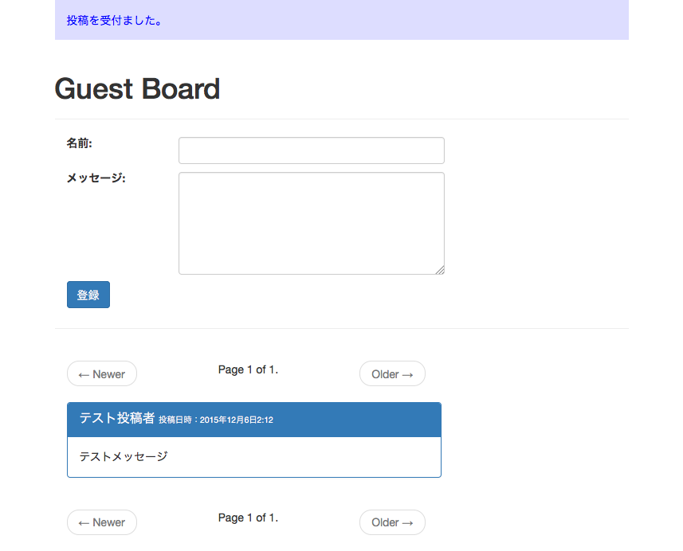
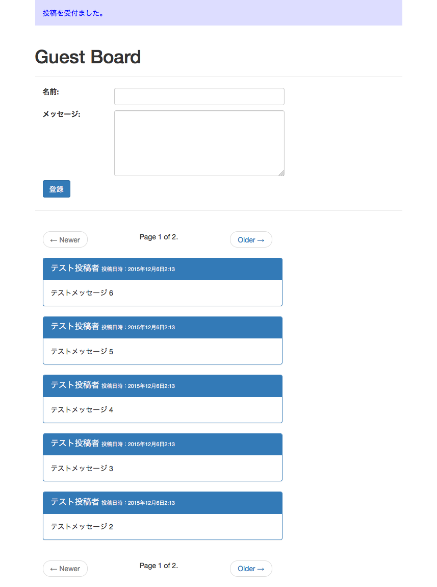
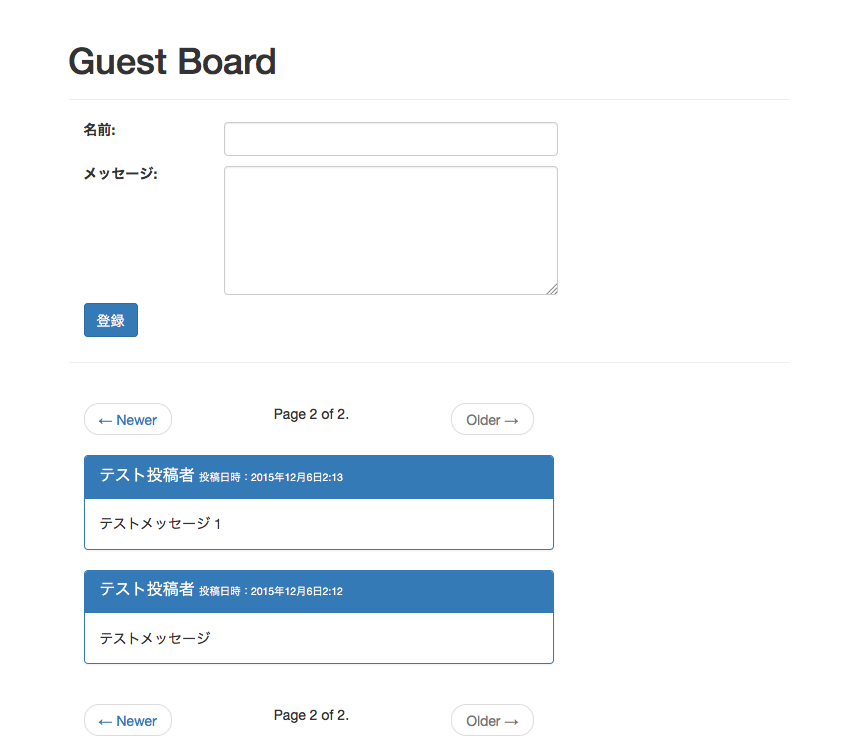

===============================================================================
動作確認をしよう
===============================================================================

http://127.0.0.1:8000/guestboard/ を表示して、以下の様な画面が表示されることを確認します。

名前・メッセージに何も入力せずに [投稿] ボタンを押下し、エラーメッセージが表示されることを確認します。

名前・メッセージに適当な文字を入力して [投稿] ボタンを押下し、受け付けられることを確認します。

投稿の件数が 5件以上になると "Older"リンクがクリック出来るようになることを確認します。

"Older" のリンクをクリックすると、 2ページ目が表示されることを確認します。

2ページ目では古い投稿が表示されていること、"Newer"リンクがクリックできるようになることを確認します。

以上で動作確認も完了です。
