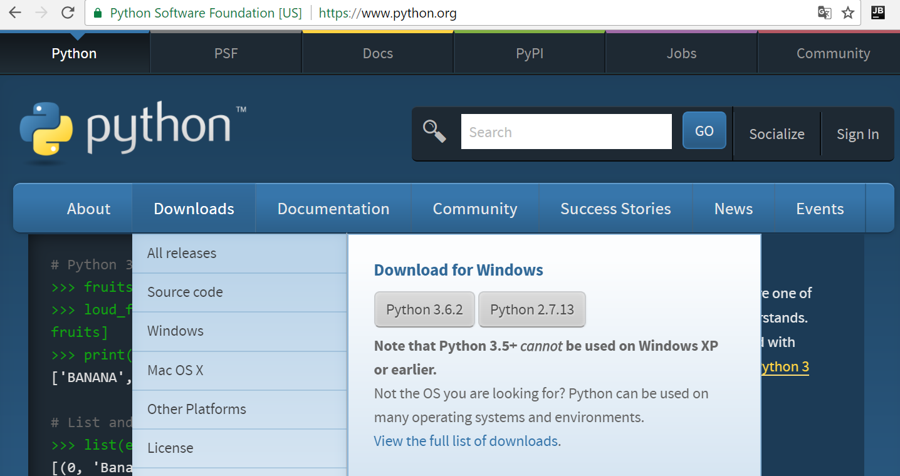
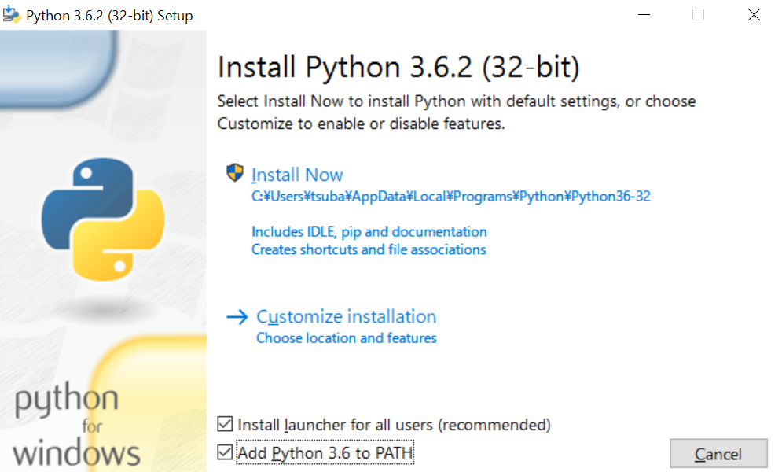
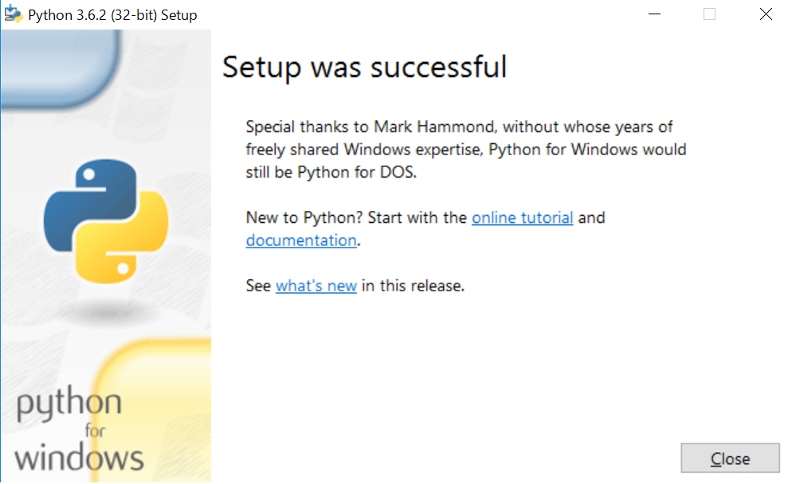

===============================================================================
環境を構築しよう（Windows）
===============================================================================

**開発環境**

:OS: Windows10
:動作確認済み環境: Python3.6, Django1.11, sqlite3

Pythonをインストールしよう
===============================================================================

https://www.python.org/downloads/ を開き、 **[ Download Python 3.6.X ]** ボタンをクリックし、Python3.6のインストーラーをダウンロードします。

- ダウンロードしたインストーラーを起動します。
- **Add Python 3.6 PATH** にチェックボックスにチェックを入れます。
- **Install Now** をクリックします。

.. warning::

    既に別のバージョンのPythonをInstallしている人は、環境変数が変わる事で既存のプログラムに

    悪影響を与える可能性があるので注意してください。

.. note::

   インストール先のフォルダーを変更した場合は、Customize installation を選択してください。

   その際、 **Advanced Options** で　**Add Python to environment variables** にチェックを入れてください。

- **Finish** ボタンをクリックして、Pythonのインストールを完了してください。

インストールが出来たか確認しよう
-------------------------------------------------------------------------------

Pythonが正常にインストールできているか確認しましょう。

**Windows PowerShell** を起動し、以下のコマンドを入力します。エラーが出なければ成功です。

.. code-block:: bash

   > python -V
   Python 3.6.2

続いて、pipが動作するか確認しましょう。

以下のコマンドを入力します。エラーが出なければ成功です。

.. code-block:: bash

   > pip -V
   pip 9.0.1 from c:\opt\bin\python\python362\lib\site-packages (python 3.6)

Pythonの仮想環境を作ろう
===============================================================================

.. note::

   仮想環境を作るメリットは、複数のシステムを開発する時に、各システム専用の環境を手軽に用意出来る事です。

   例えばシステムAではDjango1.6を、システムBではDjango1.8を使っているような場合、仮想環境がなければ
   どちらか一方のバージョンしかインストールすることができず、PC自体を分けて開発するか、
   その都度使うバージョンのDjangoをインストールしなければいけません。

   個人で1つのアプリケーションしか作らない場合、仮想環境を作るメリットはほぼ無いのですが、
   仮想環境の作り方を知っておけば追々役立ちますので、ぜひ覚えて下さい。

   どうしても仮想環境を作るのが面倒な方は、 **practiceフォルダ** を作った後、
   **Djangoをインストールしよう** まで読み飛ばして下さい。

   また、チュートリアルを進める中で仮想環境を有効にするコマンド

   > venv/Scripts/Activate.ps1

   は無視してください。

まず **venvモジュール** を使いPythonの仮想環境を作ります。venvモジュールはPythonに標準で含まれている仮想環境を作成するツールです。

開発をPyCharmで行うので、ホームディレクトリ以下にPycharmProjectsフォルダーを作ります。

その下に、学習用のDjangoプロジェクトと仮想環境を配置するためのpracticeフォルダを作ります。

.. code-block:: bash

   > mkdir "C:\PycharmProjects"
   > cd "C:\PycharmProjects"
   > mkdir practice

practiceフォルダの下に仮想環境を作ります。

.. code-block:: bash

   > python.exe -v venv venv

Pythonの仮想環境を有効にしよう
===============================================================================

作った仮想環境を有効にしましょう。

.. code-block:: bash

   venv\Scripts\Activate.ps1

成功すると、プロンプトに仮想環境のフォルダー名が括弧で囲われ表示されるようになります。

.. code-block:: bash

   (venv)>

Djangoをインストールしよう
===============================================================================

仮想環境にDjangoをインストールします。DjangoはPyPIに登録されているので、 **pip install** コマンドでインストールします。

.. code-block:: bash

   (venv)> pip install django

正しくインストールされたか、 **pip freeze** コマンドで確認しましょう。**Django==1.11.X** と表示されていれば成功です。

.. code-block:: bash

   (venv)> pip freeze
   Django==1.11.3
