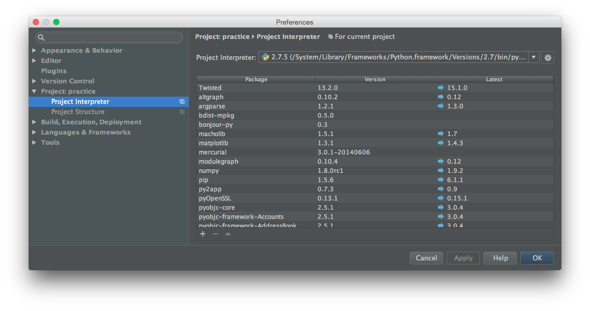

===============================================================================
番外編：PyCharmを使おう
===============================================================================

ここでは、PyCharmを使う場合のプロジェクトの作り方を説明します。PyCharmを使わない場合は飛ばして下さい。

PyCharmのプロジェクトを作ろう
===============================================================================

まず、PyCharmを使います。PyCharmのプロジェクトを作りましょう。

PyCharmを起動し、Welcome to PyCharmスクリーンから **Quick Start** > **Open...** を選択します。

フォルダーを選択する画面が表示されたら、 **ホームディレクトリ** > **PyCharmProjects** > **practice** を選択して **[Choose]** ボタンをクリックします。

PyCharmのプロジェクトが作られると、次のような画面が表示されます。

Project Interpreter
===============================================================================

Project Interpreterを確認しよう
-------------------------------------------------------------------------------

**メニューバー** > **Preferences...** を選択しPreferencesウインドを開きます。

Preferencesウインドから **Project: practice** > **Project Interpreter** を選択します。

Project Interpreterに **Pythonの仮想環境を作ろう** で作った仮想環境が表示されている場合は、何もする必要はありません。

**Project Structure** までスキップしてください。

Project Interpreterを変更しよう
-------------------------------------------------------------------------------

もし違う環境が表示されている場合は **Project Interpreter:** 右のセレクトボックスの右に表示されている **歯車** をクリックし、

表示された選択肢から **Add Local** を選択します。

フォルダーを選択する画面が表示されたら、

**ホームディレクトリ** > **PyCharmProjects** > **practice** > **venv** > **bin** > **python3** を選択して **[Choose]** ボタンをクリックします。

**Project Interpreter:** に選択した仮想環境が表示されている事を確認し、 **[Apply]** ボタンをクリックします。

Project Structure
===============================================================================

Preferencesウインドから **Project: practice** > **Project Structure** を選択します。

**mysite** フォルダーを選択して **Mark as:** > **Sources** をクリックします。

同じ要領で、 **.idea** フォルダーと **venv** フォルダーを選択して **Exclude** をクリックします。

その他
===============================================================================

Preferencesウインドから **Editor** > **General** > **Appearance** を選択します。

**Show line numbers** にチェックを入れ **[OK]** ボタンをクリックします。

設定が終わったら **Project** > **practice** > **mysite** > **mysite** > **settings.py** を開いてみましょう。

表示されたソースコードの左側に行番号が表示されていればOKです。

