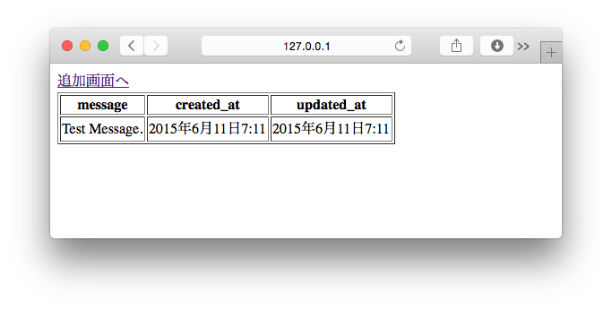
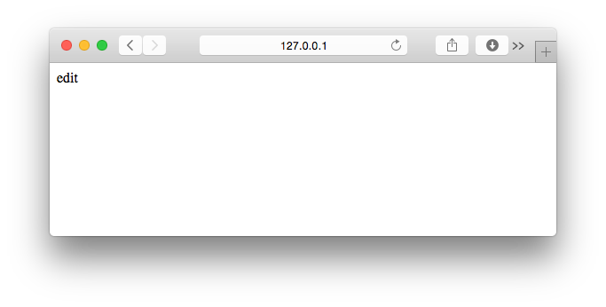
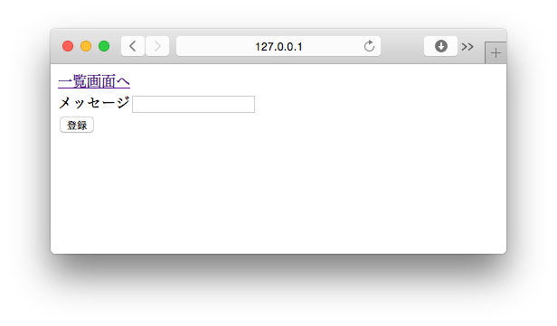
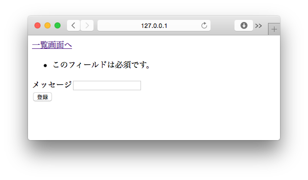
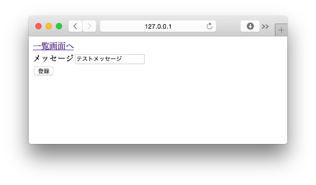
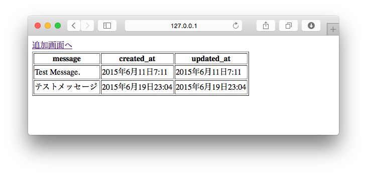

===============================================================================
登録画面を作ろう
===============================================================================

一覧画面から登録画面へリンクを張ろう
===============================================================================

登録画面へのリンクを、画面の最上部に追加します。

**templates/crud/index.html**

.. code-block:: html

    

    
        <a href="">登録画面へ</a>{# 追加する #}
        <form method="post" action="">
            ：
          （省略）
            ：

http://127.0.0.1:8000/crud/ を表示して、画面に登録画面へのリンクが表示されていることを確認して下さい。

**登録画面へ** リンクをクリックして、 http://127.0.0.1:8000/crud/add/ に遷移すれば成功です。

|django_form| を作ろう
===============================================================================

:doc:`forms` を参考に |django_form| を定義しましょう。

定義するFormクラスは、Messageモデルに登録するデータに対応します。

Messageモデルの created_atフィールド と updated_atフィールド は自動的に登録・更新されるのでFormクラスで検証する必要はありません。

**crud/forms.py** を作成してFormクラスを定義します。

.. code-block:: python

   from django import forms

   class MessageForm(forms.Form):
       message = forms.CharField(
           label='メッセージ',
           max_length=255,
           required=True,
           widget=forms.TextInput()
       )

|view_method| を編集しよう
===============================================================================

登録処理を書こう
-------------------------------------------------------------------------------

:doc:`models` を参考に登録処理を書きましょう。

MessageFormクラスの検証結果が正の場合はMessageモデルにデータを保存し、一覧画面にリダイレクトします。

それ以外の場合は登録画面を表示します。

**crud/views.py**

先ほど **forms.py** に定義した MessageFormクラスを読み込みます。

.. code-block:: python

   from django.shortcuts import render, redirect  # redirectを追加する
   from django.http import HttpResponse
   from .models import Message
   from .forms import MessageForm  # 追加する

続いて、登録用のビュー関数（ **add()** ）を書きます。

.. code-block:: python

    def add(request):
        form = MessageForm(request.POST or None)
        if form.is_valid():
            Message.objects.create(**form.cleaned_data)
            return redirect('crud:index')

        d = {
            'form': form,
        }
        return render(request, 'crud/edit.html', d)

|template_file| を編集しよう
===============================================================================

:doc:`models` を参考に |template_file| を編集します。

.. code-block:: html

    

    
        <a href="">一覧画面へ</a>
        <form action="" method="post">
            {{ form.errors.message }}
            <label>{{ form.message.label }}{{ form.message }}</label> 
            
            <input type="submit" value="登録">
        </form>
    

動作確認をしよう
===============================================================================

http://127.0.0.1:8000/crud/add/ を開いて、画面が正常に表示できる事を確認します。

**メッセージ** に何も入力せずに **[登録]** ボタンを押下すると、エラーメッセージが表示されることを確認します。

**メッセージ** に文字を入力して **[登録]** ボタンを押下すると、一覧画面に遷移し新しいメッセージが登録されていることを確認します。

以上で登録画面は終了です。