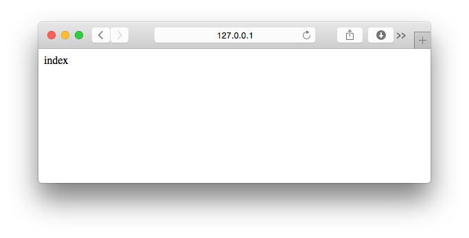
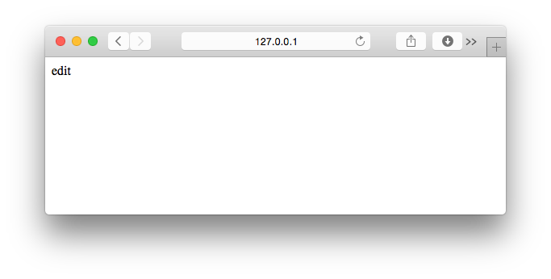

===============================================================================
新しいDjango アプリケーションを作ろう
===============================================================================

アプリケーションの概要を考えよう
===============================================================================

実際にプログラムを書く前に、作るもののイメージをまとめましょう。
今回はCreate, Read, Update, Deleteの4機能を作るので、それぞれ独立した画面にしてみましょう。

:Create: 登録画面
:Read: 一覧画面　※トップページ
:Update: 更新画面
:Delete: 削除画面

各画面のURLとビュー関数名、 |template_file| を予め決めてしまいましょう。

.. list-table::
   :widths: 1 1 4 3
   :header-rows: 1

   * - 画面名
     - ビュー関数
     - テンプレートファイル名
     - URL
   * - 一覧画面
     - index
     - templates/crud/index.html
     - /crud/
   * - 登録画面
     - add
     - | templates/crud/edit.html
       | ※編集画面と同じ入力内容なので共通化
     - /crud/add/
   * - 編集画面
     - edit
     - templates/crud/edit.html
     - /crud/edit/{対象データのID}/
   * - 削除
     - delete
     - 一覧画面にリダイレクトするのでテンプレートなし
     - /crud/delete/

Django アプリケーションを作ろう
===============================================================================

:doc:`application` を参考に、新しく **crud** と言う名前のアプリケーションを作りましょう

**Mac環境**

.. code-block:: bash

   $ cd ~/PycharmProjects/practice/
   $ source venv/bin/activate
   (venv)$ python mysite/manage.py startapp crud

**Windows環境**

.. code-block:: bash

   > cd "C:\PycharmProjects\practice"
   > venv\Scripts\Activate.ps1
   (venv)> python mysite\manage.py startapp crud

アプリケーションを作ったら、Djangoプロジェクトに登録しましょう。

**設定ファイル** の **INSTALLED_APPS** に **crud** を追加します。

**mysite/settings.py**

.. code-block:: python

    INSTALLED_APPS = (
        'django.contrib.admin',
        'django.contrib.auth',
        'django.contrib.contenttypes',
        'django.contrib.sessions',
        'django.contrib.messages',
        'django.contrib.staticfiles',
        'hello',
        'crud',  # 追加する
    )

画面表示ができる最低限のプログラムを書こう
===============================================================================

今回は、 **『アプリケーションの概要を考えよう』** で、どのURLでどの画面を作るかすでに決めています。

そこで、予め使う |url_conf| ・ |view_method| ・ |template_file| をすべて作ってしまいましょう。
作る内容については、 |template_file| を使わない **削除画面** は :doc:`views_and_urls` で書いたものと同等のものを、
それ以外は :doc:`templates` で書いたものと同等のもので十分です。
予め必要な |url_conf| ・ |view_method| ・ |template_file| を作るのは、以下のメリットがあります。

- まとめて作業することで、複数のファイルやフォルダーを切り替える手間が減り作業が早くなります
- 画面が表示できる状態にしておくことで、エラーが発生した時に見る場所を直前に編集したファイルに限定できます

ビュー関数を書こう
===============================================================================

|view_method| を書いていきます。

**crud/views.py**

.. code-block:: python

    from django.shortcuts import render
    from django.http import HttpResponse

    def index(request):
        return render(request, 'crud/index.html', {})

    def add(request):
        return render(request, 'crud/edit.html', {})

    def edit(request, editing_id):
        return render(request, 'crud/edit.html', {})

    def delete(request):
        return HttpResponse('Delete')

URLConfを書こう
===============================================================================

**crud** アプリケーションに **urls.py** を作成します。

**crud/urls.py**

.. code-block:: python

    from django.conf.urls import url
    from . import views

    urlpatterns = [
        url(r'^$', views.index, name='index'),
        url(r'^add/$', views.add, name='add'),
        url(r'^delete/$', views.delete, name='delete'),
        url(r'^edit/(?P<editing_id>\d+)/$', views.edit, name='edit'),
    ]

プロジェクトの **urls.py** から、 **crud** アプリケーションの **urls.py** を呼び出します。

**mysite/urls.py**

.. code-block:: python

    from django.conf.urls import include, url

    urlpatterns = [
        url(r'^hello/', include('hello.urls', namespace='hello')),
        url(r'^crud/', include('crud.urls', namespace='crud')),  # 追加する
    ]

|template_file| を作ろう
===============================================================================

**templates** フォルダーの下に **crud** フォルダーを作り、その中に必要な |template_file| を作ります。

.. code-block:: bash

   templates/
        crud/
            edit.html
            index.html

**templates/crud/index.html**

.. code-block:: html

    

    
        index
    

**templates/crud/edit.html**

.. code-block:: html

    

    
        edit
    

動作確認をしよう
===============================================================================

http://127.0.0.1:8000/crud/

http://127.0.0.1:8000/crud/add/

http://127.0.0.1:8000/crud/edit/1/

http://127.0.0.1:8000/crud/delete/

これで各画面にアクセスできるようになりました。続いて、各機能を実装していきましょう。
