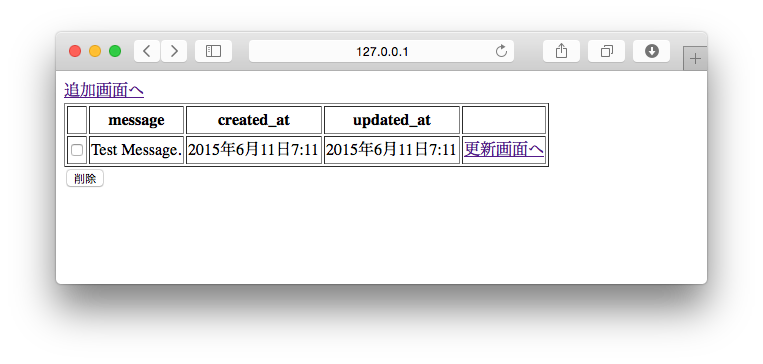
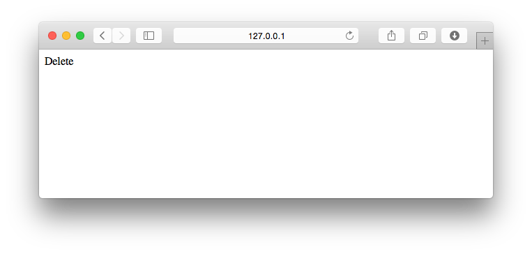
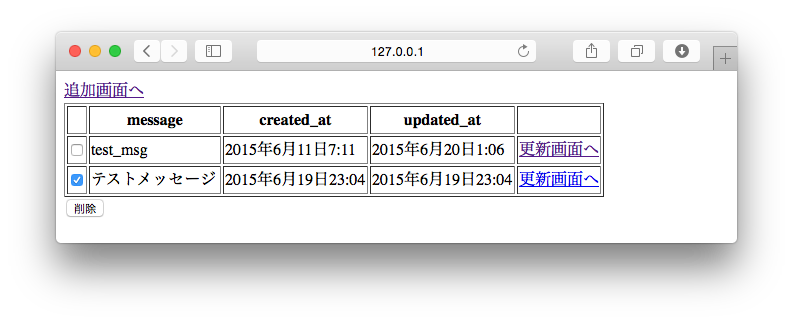
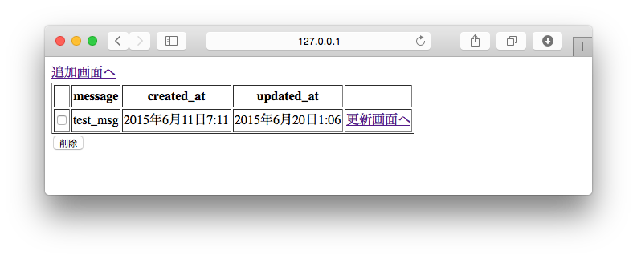

===============================================================================
一覧画面に削除機能を追加しよう
===============================================================================

登録画面から削除画面へPOSTするフォームを作ろう
===============================================================================

削除画面にも、どのデータを削除するか渡す必要があります。
更新画面と違い複数のデータを同時に削除するケースも考えられるので、チェックボックスで削除対象のデータを選択できるようにします。

**templates/crud/index.html**

.. code-block:: html

    

    
      <a href="">登録画面へ</a>
      <form method="post" action="">{# actionを変更する #}
        <table border="1">
          <thead>
            <tr>
              <th>　</th>{# 追加する #}
              <th>message</th>
              <th>created_at</th>
              <th>updated_at</th>
              <th>　</th>
            </tr>
          </thead>
          <tbody>
            
              <tr>
                <td><input type="checkbox" name="delete_ids" value="{{ message.id }}"></td>{# 追加する #}
                <td>{{ message.message }}</td>
                <td>{{ message.created_at }}</td>
                <td>{{ message.updated_at }}</td>
                <td><a href="">更新画面へ</a></td>
              </tr>
            
          </tbody>
        </table>
        {# 追加する #}
        <input type="submit" value="削除">
      </form>
    

http://127.0.0.1:8000/crud/ を表示して、画面にチェックボックスと、[削除]ボタンが表示されていることを確認して下さい。

**[削除]ボタン** を押下して http://127.0.0.1:8000/crud/delete/ に遷移すれば成功です。

|view_method| を編集しよう
===============================================================================

削除処理を書こう
-------------------------------------------------------------------------------

削除画面の動きは以下のとおりです。

- 削除対象のIDを受け取る
- IDが1件以上あれば削除を実行する
- 一覧画面にリダイレクトする

また、削除画面はPOSTリクエストの時にしか処理を行わないので、 |view_method| にアクセスできるHTTPメソッドをPOSTに制限します。

|view_method| にアクセスできるHTTPメソッドをPOSTに制限するには、 **require_POST** デコレーターを使います。

**crud/views.py**

.. code-block:: python

    from django.shortcuts import (
        render,
        redirect,
        get_object_or_404,
    )
    from django.views.decorators.http import require_POST  # 追加する
    from .models import Message
    from .forms import MessageForm

削除処理（ **delete()** ）を書きます。

.. code-block:: python

    @require_POST
    def delete(request):
        delete_ids = request.POST.getlist('delete_ids')
        if delete_ids:
            Message.objects.filter(id__in=delete_ids).delete()
        return redirect('crud:index')

動作確認をしよう
===============================================================================

一覧画面で、削除対象のレコードにチェックをつけ **[削除]** ボタンを押下します。

一覧画面が再表示され、チェックをつけたレコードが削除されていることを確認します。

以上で削除画面は終了です。
