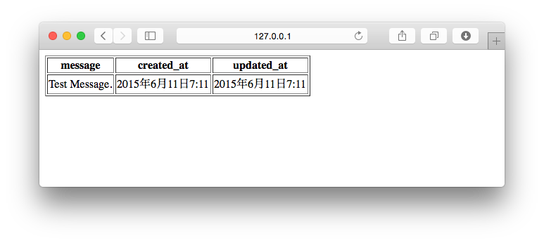

===============================================================================
一覧表示画面を作ろう
===============================================================================

|django_model| を作ろう
===============================================================================

:doc:`models` を参考に、Modelクラスを定義しましょう。

今回定義するModelクラスは、データベースでは以下のテーブル構造になります。

.. list-table::
   :header-rows: 1
   :widths: 2 2 2 1 1 1 2 3 3

   * - 論理名
     - 物理名
     - データ型
     - 長さ
     - 必須
     - キー
     - 外部キー
     - デフォルト値
     - 備考
   * - ID
     - id
     - INT
     -
     - YES
     - PK
     -
     -
     - AUTO INCREMENT
   * - メッセージ
     - message
     - varchar
     - 255
     - YES
     -
     -
     -
     -
   * - 登録日
     - created_at
     - datetime
     -
     - YES
     -
     -
     - 登録した日時
     -
   * - 更新日
     - updated_at
     - datetime
     -
     - YES
     -
     -
     - 登録した日時
     - 更新日時を保持する

Modelクラスを定義しよう
-------------------------------------------------------------------------------

**crud/models.py**

.. code-block:: python

    from django.db import models

    class Message(models.Model):
        message = models.CharField(max_length=255)
        created_at = models.DateTimeField(auto_now_add=True)
        updated_at = models.DateTimeField(auto_now=True)

        def __str__(self):
            return u"{0}:{1}... ".format(self.id, self.message[:10])

DateTimeFieldに設定しているパラメーターの詳細は以下の表の通りです。

:auto_now: オブジェクトを保存する度に、その時の時刻を自動的に設定します。タイムスタンプの実現に便利です。
:auto_now_add: オブジェクトを生成した時の時刻を自動的に設定します。登録日タイムスタンプの実現に便利です。

これらのパラメーターを使った場合、任意の値で更新できなくなるので注意してください。

migrateを行おう
-------------------------------------------------------------------------------

定義したMessageモデルをデータベースに反映させましょう。

.. code-block:: bash

   (venv)$ python mysite/manage.py makemigrations
   (venv)$ python mysite/manage.py migrate

makemigrationsが成功した時には次のメッセージが表示されます。

.. code-block:: bash

    Migrations for 'crud':
      0001_initial.py:
        - Create model Message

migrateを行います。

.. code-block:: bash

   (venv)$ python mysite/manage.py migrate

migrateが成功した時には次のメッセージが表示されます。

.. code-block:: bash

    Operations to perform:
      Synchronize unmigrated apps: staticfiles, messages
      Apply all migrations: auth, hello, admin, sessions, crud, contenttypes
    Synchronizing apps without migrations:
      Creating tables...
        Running deferred SQL...
      Installing custom SQL...
    Running migrations:
      Rendering model states... DONE
      Applying crud.0001_initial... OK

Django shellから表示確認用のデータを作ろう
-------------------------------------------------------------------------------

一覧画面を作る時に、表示するデータが無いと問題の有無がわかりません。表示確認用にデータを1件追加しておきます。

以下のコマンドを実行し、インタラクティブシェル（Django shell）を起動します。

.. code-block:: bash

    (venv)$ python mysite/manage.py shell
    >>>

インタラクティブシェルから、データを追加するコマンドを実行します。

.. code-block:: python

    >>> from crud.models import Message
    >>> Message.objects.create(message=u'Test Message.')

|view_method| を編集しよう
===============================================================================

画面表示で使うデータを取得しよう
-------------------------------------------------------------------------------

画面には、Messageモデルに登録されているデータをすべて表示します。

**crud/views.py**

.. code-block:: python

    from django.shortcuts import render
    from django.http import HttpResponse
    from .models import Message  # 追加する

一覧表示処理（ **index()** ）を追加します。

.. code-block:: python

    def index(request):
        d = {
            'messages': Message.objects.all(),
        }
        return render(request, 'crud/index.html', d)

|template_file| を編集しよう
===============================================================================

Messageモデルに登録されているデータを表示しよう
-------------------------------------------------------------------------------

**templates/crud/index.html**

.. code-block:: html

    

    
      <form method="post" action="">
        <table border="1">
          <thead>
            <tr>
              <th>message</th>
              <th>created_at</th>
              <th>updated_at</th>
            </tr>
          </thead>
          <tbody>
            
              <tr>
                <td>{{ message.message }}</td>
                <td>{{ message.created_at }}</td>
                <td>{{ message.updated_at }}</td>
              </tr>
            
          </tbody>
        </table>
      </form>
    

http://127.0.0.1:8000/crud/ を表示して、表示確認用に登録したデータが表示されていれば成功です。

