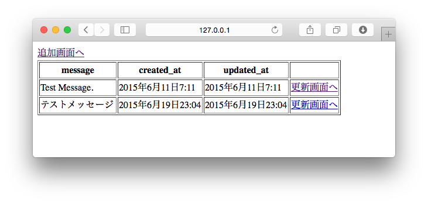
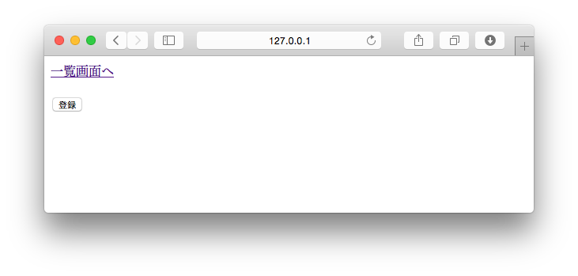
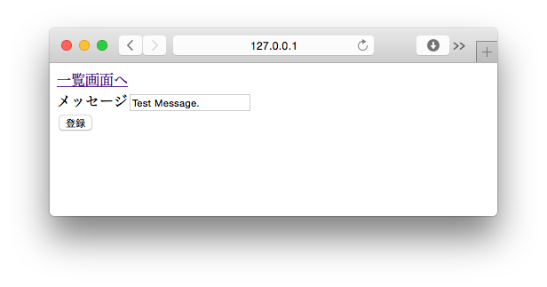
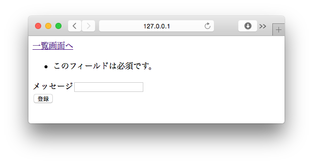
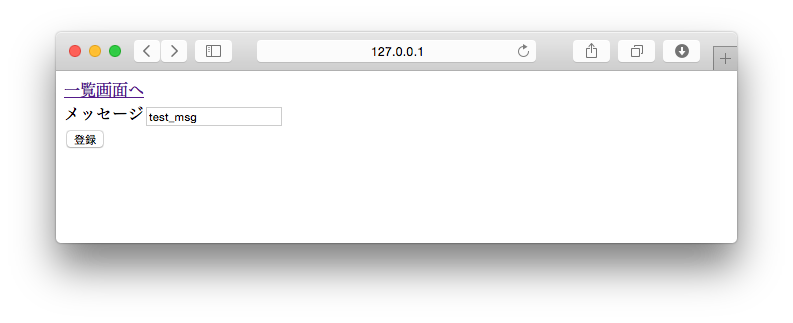
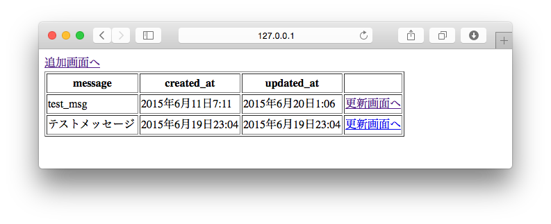

===============================================================================
更新画面を作ろう
===============================================================================

一覧画面から更新画面へリンクを張ろう
===============================================================================

更新画面へ遷移するリンクは、更新するデータを特定する情報をURLに含める必要があります。今回はIDを使います。

**templates/crud/index.html**

.. code-block:: html

    

    
      <a href="">登録画面へ</a>
      <form method="post" action="">
        <table border="1">
          <thead>
            <tr>
              <th>message</th>
              <th>created_at</th>
              <th>updated_at</th>
              <th>　</th>{# 追加する #}
            </tr>
          </thead>
          <tbody>
            
              <tr>
                <td>{{ message.message }}</td>
                <td>{{ message.created_at }}</td>
                <td>{{ message.updated_at }}</td>
                <td><a href="">更新画面へ</a></td>{# 追加する #}
              </tr>
            
          </tbody>
        </table>
      </form>
    

http://127.0.0.1:8000/crud/ を表示して、画面に更新画面へのリンクが表示されていることを確認して下さい。

**更新画面へ** リンクをクリックして、 http://127.0.0.1:8000/crud/edit/1/ に遷移すれば成功です。

.. note::

    更新画面は、まだ |view_method| を修正していないので入力フォームは表示されません。

|view_method| を編集しよう
===============================================================================

更新処理を書こう
-------------------------------------------------------------------------------

更新画面は登録画面と以下の点が異なります。

- 一覧画面から最初に遷移したときは **メッセージ** に現在設定されている値を表示します。
- URLに含まれるIDを持つデータが存在しない場合は、例外を発生させる。
- 登録時は、すでに存在しているDBのレコードを更新する。

**crud/views.py**

ヘッダー部で **get_object_or_404** メソッドを読み込みます。

これについては、更新処理の所でどのような処理か説明します。

.. code-block:: python

    from django.shortcuts import (
        render,
        redirect,
        get_object_or_404,  # 追加する
    )
    from django.http import HttpResponse
    from .models import Message
    from .forms import MessageForm

更新処理（ **edit()** ）を書きます。

.. code-block:: python

    def edit(request, editing_id):
        message = get_object_or_404(Message, id=editing_id)
        if request.method == 'POST':
            form = MessageForm(request.POST)
            if form.is_valid():
                message.message = form.cleaned_data['message']
                message.save()
                return redirect('crud:index')
        else:
            # GETリクエスト（初期表示）時はDBに保存されているデータをFormに結びつける
            form = MessageForm({'message': message.message})
        d = {
            'form': form,
        }

        return render(request, 'crud/edit.html', d)

.. note::

    *message = get_object_or_404(Message, id=editing_id)* はURLに設定されたediting_idを使い、Messageモデルから1件だけデータを取得します。

    1件もデータが取得できない、または2件以上データが取得できた場合はエラーが発生します。今回はIDを検索条件に使っているので、2件以上データが取得できることはありません。

    *message = get_object_or_404(Message, id=editing_id)* は次のように書いた場合と同じ動作をします。

.. code-block:: python

    from django.http import Http404
    try:
        message = Message.objects.get(id=editing_id)
    except Message.DoesNotExist:
        raise Http404

動作確認をしよう
===============================================================================

http://127.0.0.1:8000/crud/edit/1/ を表示して **メッセージ** に一覧画面に表示されていたものと同じ値が表示されていることを確認します。

**メッセージ** を空欄にして **[登録]** ボタンを押下すると、エラーメッセージが表示されることを確認します。

**メッセージ** に初期表示と異なる値を設定して **[登録]** ボタンを押下すると一覧画面に遷移し、 **message** と **updated_at** が更新されていることを確認します。

以上で更新画面は終了です。
