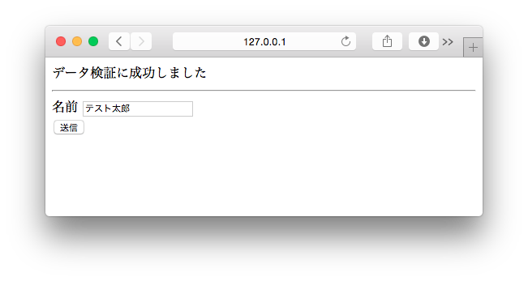

===============================================================================
Djangoフォームを使ってみよう
===============================================================================

色々なWebサービスの入力画面を思い出してみてください。
テキストボックス・セレクトボックス・チェックボックス・ラジオボタン・・・それらを選択していなかったり、誤った入力をしていたまま送信した時には、入力データが元のフォームに表示された状態で、どのようなエラーかメッセージが表示されていたと思います。

Djangoには、これらの機能を実現する為の **Formクラス** が用意されています。Formクラスを使って、Webフォームを作ってみましょう。

Formクラスを定義しよう
===============================================================================

**hello** アプリケーションに **forms.py** を作成し、 **HelloForm** クラスを定義します。

**hello/forms.py**

.. code-block:: python

   from django import forms

   class HelloForm(forms.Form):
       your_name = forms.CharField(
           label='名前',
           max_length=20,
           required=True,
           widget=forms.TextInput()
       )

Formクラスは幾つかの概念を扱います。

:Form(フォーム): 関連するフィールドをまとめて扱うための箱のようなイメージです。
:Field(フィールド): データ検証を行うためのクラスです。
:Widget(ウィジェット): HTMLのフォームタイプ（<input type="text">）など に対応するクラスです。

言葉だけ見ると理解し難いと思うので、幾つか例を挙げてみたいと思います。

選択肢の中から1つを選ぶようなデータの場合、 **Field** は **ChoiceField** を使います。しかし、画面でラジオボタンで選択させたい場合や、セレクトボックスで選択させたい場合など表示を変えたい場合があります。

このように、データと表示形式を分離させる為に、 **Field** と **Widget** と言う概念に分かれています。

**Field** は入力されたデータ検証を行います。ユーザー名や連絡先など入力を強制させたいFieldは **required** (必須入力)とします。また、名前のように入力される文字数が推測できる場合は **max_length** (最大入力文字数)のチェックをします。

ビュー関数からFormクラスを使おう
===============================================================================

**views.py** にFormクラスを使うための **ビュー関数** を定義します。

**hello/views.py**

.. code-block:: python

   from . import forms

   def hello_forms(request):
       form = forms.HelloForm(request.GET or None)
       if form.is_valid():
           message = 'データ検証に成功しました'
       else:
           message = 'データ検証に失敗しました'
       d = {
           'form': form,
           'message': message,
       }
       return render(request, 'forms.html', d)

.. note::

   **request.GET or None** と言う書き方は、request.GET をブール値として評価した時にTrueと判定されるならrequest.GETを、Falseとして判断されるならNoneをHelloForm.__init__()メソッドに渡します。

   HelloForm.__init__()メソッドにrequest.GETを渡した場合の挙動とNoneを渡した場合の挙動は、Djangoドキュメントの **束縛フォームと非束縛フォーム** を参考にしてください。

   `束縛フォームと非束縛フォーム <http://django-docs-ja.readthedocs.org/en/latest/ref/forms/api.html#ref-forms-api-bound-unbound>`_

テンプレートからFormクラスを使おう
===============================================================================

**templates/forms.html**

.. code-block:: html

   

   
     {{ message }}
     

     <form method="get" action="">
       {{ form.errors.your_name }}
       <label>{{ form.your_name.label }} {{ form.your_name }}</label> 

       {{ form.errors.gender }}
       <label>{{ form.gender.label }} {{ form.gender }}</label> 

       {{ form.errors.memo }}
       <label style="vertical-align: top;">{{ form.memo.label }} {{ form.memo }}</label> 

       <input type="submit" value="送信">
     </form>
   

URLディスパッチャを書こう
===============================================================================

既にお約束ですね。URLConfを編集して、作ったビュー関数を呼び出せるようにしましょう。

**hello/urls.py**

.. code-block:: python

   from django.conf.urls import url
   from . import views

   urlpatterns = [
       url(r'^$', views.hello_world, name='hello_world'),
       url(r'^template/$', views.hello_template, name='hello_template'),
       url(r'^if/$', views.hello_if, name='hello_if'),
       url(r'^for/$', views.hello_for, name='hello_for'),
       url(r'^get/$', views.hello_get_query, name='hello_get_query'),
       url(r'^forms/$', views.hello_forms, name='hello_forms'), # 追加する
   ]

動作確認をしてみよう
===============================================================================

画面を表示しよう
-------------------------------------------------------------------------------

データ検証には失敗していても、エラーメッセージが表示されていなければ正常です。

何も入力せずに送信してみよう
-------------------------------------------------------------------------------

データ検証には失敗していて、エラーメッセージも表示されていなければ正常です。

名前を入力して送信してみよう
-------------------------------------------------------------------------------

データ検証に成功していれば正常です。

その他、Formクラスについて
===============================================================================

Formクラスは非常に機能が豊富です。幾つかサンプルを載せておきますので参考にしてください。

.. list-table::
   :widths: 2 2 5
   :header-rows: 1

   * - Field
     - default widget
     - データへの正規化
   * - CharField
     - TextInput
     - Unicode文字列
   * - ChoiceField
     - Select
     - Unicode文字列
   * - MultipleChoiceField
     - SelectMultiple
     - Unicode文字列のリスト
   * - IntegerField
     - NumberInput
     - 整数型または長整数型
   * - DateField
     - TextInput
     - datetime.date

**hello/forms.py**

.. code-block:: python

    # 定義済みのクラスやimportを消さずに、
    # 本ファイル末尾に追記する形で定義してください。

    EMPTY_CHOICES = (
        ('', '-'*10),
    )

    GENDER_CHOICES = (
        ('man', '男'),
        ('woman', '女')
    )

    FOOD_CHOICES = (
        ('apple', 'りんご'),
        ('beef', '牛肉'),
        ('bread', 'パン'),

    )

    class SampleForm(forms.Form):
        age = forms.IntegerField(
            label='年齢',
            min_value=0,
            max_value=200,
            required=True,
        )

        birthday = forms.DateField(
            label='生年月日',
            required=True,
            input_formats=[
                '%Y-%m-%d',  # 2010-01-01
                '%Y/%m/%d',  # 2010/01/01
            ]
        )

        send_message = forms.BooleanField(
            label='送信する',
            required=False,
        )

        gender_r = forms.ChoiceField(
            label='性別',
            widget=forms.RadioSelect,
            choices=GENDER_CHOICES,
            required=True,
        )

        gender_s = forms.ChoiceField(
            label='性別',
            widget=forms.Select,
            choices=EMPTY_CHOICES + GENDER_CHOICES,
            required=False,
        )

        food_s = forms.ChoiceField(
            label='食べ物',
            widget=forms.SelectMultiple,
            choices=FOOD_CHOICES,
            required=True,
        )

        food_c = forms.ChoiceField(
            label='食べ物',
            widget=forms.CheckboxSelectMultiple,
            choices=FOOD_CHOICES,
            required=True,
        )

**hello/views.py**

.. code-block:: python

    # 定義済みのクラスやimportを消さずに、
    # 本ファイル末尾に追記する形で定義してください。

    def hello_forms2(request):
        d = {
            'form': forms.SampleForm(),
        }
        return render(request, 'form_samples.html', d)

**hello/urls.py**

.. code-block:: python

    from django.conf.urls import url
    from . import views

    urlpatterns = [
        url(r'^$', views.hello_world, name='hello_world'),
        url(r'^template/$', views.hello_template, name='hello_template'),
        url(r'^if/$', views.hello_if, name='hello_if'),
        url(r'^for/$', views.hello_for, name='hello_for'),
        url(r'^get/$', views.hello_get_query, name='hello_get_query'),
        url(r'^forms/$', views.hello_forms, name='hello_forms'),
        url(r'^form_samples/$', views.hello_forms2, name='hello_forms2'),  # 追加する
    ]

**templates/form_samples.html**

.. code-block:: html

    

    
      <form method="get" action="">
        {{ form.age.label }}：
        {{ form.age }}
        

        {{ form.gender_r.label }}：
        
          {{ gender }}
        
        

        {{ form.gender_s.label }}：
        {{ form.gender_s }}
        

        {{ form.send_message.label }}：
        {{ form.send_message }}
        

        {{ form.birthday.label }}：
        {{ form.birthday }}
        

        {{ form.food_s.label }}：
        {{ form.food_s }}
        

        {{ form.food_c.label }}：
        
          {{ food }}
        
        

      </form>
    

表示結果
-------------------------------------------------------------------------------

