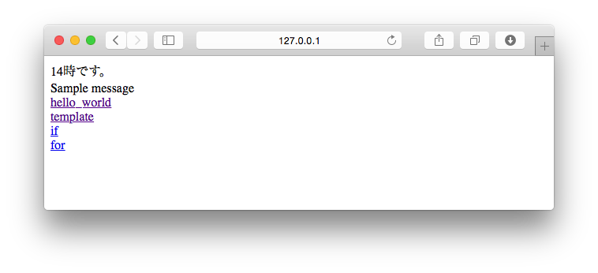

===============================================================================
他の画面へリンクを張ろう
===============================================================================

テンプレートに、別の画面に飛ぶリンクを書いてみましょう。

Djangoのテンプレートタグには、ビュー関数やURLディスパッチャを元に絶対URLを返す **URLタグ** が存在します。

http://127.0.0.1:8000/hello/template/ から今まで作った画面へのリンクを張ってみましょう。

URLタグを使おう
===============================================================================

URLタグは次のように書きます。

.. code-block:: html

   

namespaceはプロジェクトのURLConf（ **mysite** の **urls.py** ）に、nameは **hello** アプリケーションの **urls.py** に設定しています。

この情報をもとに、URLディスパッチャを見てみましょう。

namespaceとnameを確認する
-------------------------------------------------------------------------------

**urls.py** の **urlpatterns** を見てみましょう。**プロジェクト（mysite）のurls.py** には **namespace** が、 **hello** アプリケーションの **urls.py** には **name** が書かれています。

**mysite/urls.py**

.. code-block:: python

    urlpatterns = [
        url(r'^hello/', include('hello.urls', namespace='hello')),
    ]

**hello/urls.py**

.. code-block:: python

    urlpatterns = [
        url(r'^$', views.hello_world, name='hello_world'),
        url(r'^template/$', views.hello_template, name='hello_template'),
        url(r'^if/$', views.hello_if, name='hello_if'),
        url(r'^for/$', views.hello_for, name='hello_for'),
    ]

index.htmlに他のページへのリンクを張る
-------------------------------------------------------------------------------

**templates/index.html**

.. code-block:: html

    
    変数の練習
    
      

        {{ hour }}時です。 
        {{ message }}
      

      

        <a href="">hello_world</a> 
        <a href="">template</a> 
        <a href="">if</a> 
        <a href="">for</a> 
      

    

http://127.0.0.1:8000/hello/template/ にアクセスしてリンクが表示されれば成功です。

