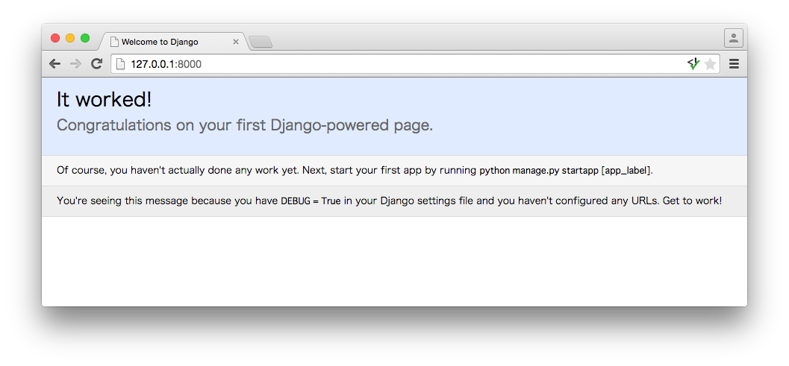

===============================================================================
Django プロジェクトを作ろう
===============================================================================

.. note::

   仮想環境が有効になっている事を確認してください。

プロジェクトを作ろう
===============================================================================

プロジェクトを作ります。プロジェクトとは、設定ファイルやDjango アプリケーション（後で説明します）など、開発するWebアプリケーションに関するものをあつめたものです。

仮想環境を有効にしてから、Django プロジェクトを構成するコードを自動生成するコマンド（ startproject ）を実行しましょう。コマンドが成功すると、現在のフォルダーに **mysite** フォルダーが作られます。

**Mac環境**

.. code-block:: bash

   $ cd ~/PycharmProjects/practice/
   $ source venv/bin/activate
   (venv)$ django-admin.py startproject mysite

**Windows環境**

.. code-block:: bash

   > cd "C:\PycharmProjects\practice"
   > venv\Scripts\Activate.ps1
   (venv)> django-admin.py startproject mysite

startproject が作ったファイルを確認してみましょう。

.. code-block:: bash

   mysite/
       manage.py
       mysite/
           __init__.py
           settings.py
           urls.py
           wsgi.py

それぞれのファイルについてはDjangoのドキュメントを確認してください。

`http://django-docs-ja.readthedocs.org/en/latest/intro/tutorial01.html <http://django-docs-ja.readthedocs.org/en/latest/intro/tutorial01.html>`_

開発サーバーを起動しよう
===============================================================================

ローカルマシン上に開発用のWebサーバーを立ち上げ、Djangoが正常に動作する事を確認します。

開発用のWebサーバーは以下のコマンドで起動します。

.. code-block:: bash

   (venv)$ python mysite/manage.py runserver

開発用のWebサーバーの起動に成功すると、ターミナル上に次のメッセージが表示されます。

.. code-block:: bash

    Performing system checks...

    System check identified no issues (0 silenced).

    You have unapplied migrations; your app may not work properly until they are applied.
    Run 'python mysite/manage.py migrate' to apply them.

    May 02, 2015 - 03:42:51
    Django version 1.8, using settings 'mysite.settings'
    Starting development server at http://127.0.0.1:8000/
    Quit the server with CONTROL-C.

開発用サーバーを終了する場合は、 **Ctrl + C** を押してください。

.. note::

    *You have unapplied migrations ....* というメッセージは、migrateを実行していない場合に表示されます。

    migrateについては別のチュートリアルで説明しますので、このメッセージは無視してください。

Webブラウザで `http://127.0.0.1:8000/ <http://127.0.0.1:8000/>`_ を開いてみましょう。ウェルカムスクリーンが表示されていれば成功です。

