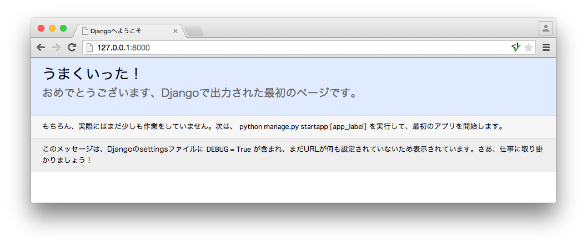

===============================================================================
設定ファイルを編集しよう
===============================================================================

Djangoの設定ファイル（settings.py）は、標準では日本で使われる設定になっていません。

日本で使う為の設定をしましょう。

言語コードを変更しよう
===============================================================================

言語コードを日本語に変更します。ウェルカムスクリーンに表示されているメッセージや、

Validation Errorのメッセージなどが日本語化されます。

言語コードを日本語にするには、 **設定ファイル（settings.py）** の **LANGUAGE_CODE** を変更します。

**mysite/settings.py**

.. code-block:: python

   LANGUAGE_CODE = 'ja'

保存後、開発サーバーを起動して http://127.0.0.1:8000/ にアクセスしましょう。

.. code-block:: bash

   (venv)$ python mysite/manage.py runserver

ウェルカムスクリーンが日本語化されていれば成功です。

タイムゾーンを変更しよう
===============================================================================

タイムゾーンも標準では日本のものになっていません。このままだと日付を扱おうとした時に

想定していない時間（海外の時間）になる可能性があるので、タイムゾーンも日本のものに変更しましょう。

タイムゾーンを変更するには、 **設定ファイル（settings.py）** の **TIME_ZONE** を変更します。

**mysite/settings.py**

.. code-block:: python

   TIME_ZONE = 'Asia/Tokyo'

なお、タイムゾーンを扱うためのモジュールである **pytz** のインストールが推奨されていますので、ここでインストールしておきましょう。

.. code-block:: bash

   (venv)$ pip install pytz
