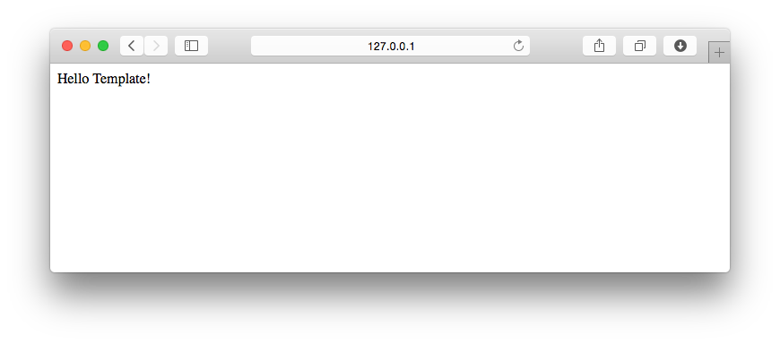
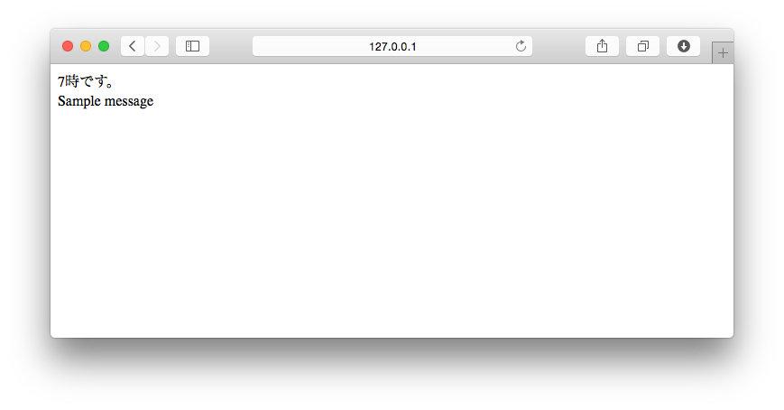
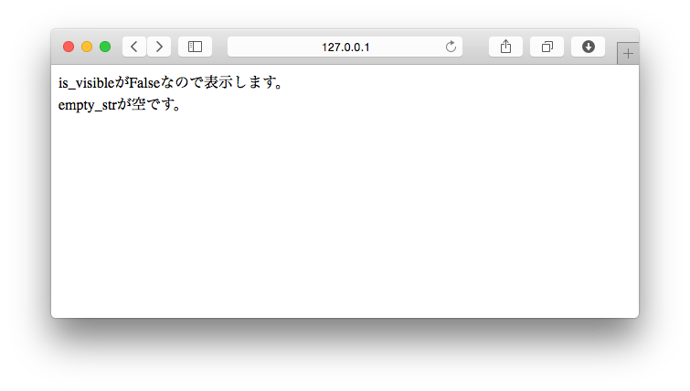
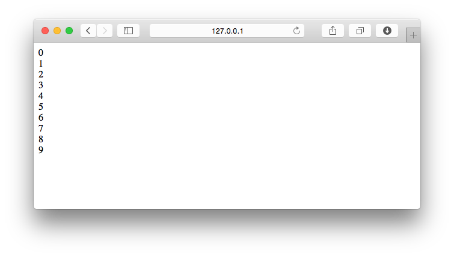

===============================================================================
テンプレートを使おう
===============================================================================

**Hello World! を表示しよう** ではWebレスポンスとして返す文字をプログラムに直接書きました。

しかし、ウェブレスポンスにウェブページ（HTML）を返す場合、直接プログラムにHTMLを書くのは大変です。

そこでデザインなどの静的な部分は **テンプレート** としてHTMLファイルに書いていきましょう。

設定ファイルにテンプレートを置くフォルダーを指定しよう
===============================================================================

テンプレートを置くフォルダーは、 **mysite/settings.py** の　**TEMPLATES** に設定します。

基本的な設定は既に書かれていますので、 **DIRS** だけ以下の表のように修正しましょう。

:DIRS: [os.path.join(BASE_DIR, 'templates'),]

**mysite/settings.py**

.. code-block:: python

   TEMPLATES = [
       {
           'BACKEND': 'django.template.backends.django.DjangoTemplates',
           'DIRS': [
               os.path.join(BASE_DIR, 'templates'),
           ],
           'APP_DIRS': True,
           'OPTIONS': {
               'context_processors': [
                   'django.template.context_processors.debug',
                   'django.template.context_processors.request',
                   'django.contrib.auth.context_processors.auth',
                   'django.contrib.messages.context_processors.messages',
               ],
           },
       },
   ]

.. note::

   BASE_DIR は practice/mysite/フォルダーをさしています。どのような処理でこのフォルダが指定されるかは、

   以下の関数や特殊なグローバス変数について調べてみましょう。

   - os.path.dirname()
   - os.path.abspath()
   - __file__

テンプレートを置くフォルダーを作ろう
===============================================================================

カレントフォルダー（ **~/PycharmProjects/practice/mysite/** ）に **templates/** フォルダーを追加します。

ここではコマンドラインを使って説明していますが、PyCharmのProjectタブから追加しても問題ありません。

**Mac環境**

.. code-block:: bash

   $ cd ~/PycharmProjects/practice/mysite/
   $ mkdir templates

**Windows環境**

.. code-block:: bash

   > cd "C:\PycharmProjects\practice\mysite"
   > mkdir templates

.. code-block:: bash

   mysite/
       manage.py
       hello/
       mysite/
       templates/

テンプレートファイルを作ろう
===============================================================================

**templates** フォルダーに **index.html** ファイルを作り、 **Hello Template!** と表示するHTMLを書きます。

フォルダー構成

.. code-block:: bash

   mysite/
       manage.py
       hello/
       mysite/
       templates/
           index.html

**templates/index.html**

.. code-block:: html

    <!DOCTYPE html>
    <html>
    <head lang="ja">
        <meta charset="UTF-8">
        <title></title>
    </head>
    <body>
    Hello Template!
    </body>
    </html>

ビュー関数からテンプレートファイルを使おう
===============================================================================

テンプレートファイルを使ってHTMLのウェブレスポンスを返すビュー関数を作る場合、**render関数** を使います。

**views.py** で **render関数** をインポートします。

**hello/views.py**

.. code-block:: python

   from django.http.response import HttpResponse
   from django.shortcuts import render # 追加する

**render関数** を使いテンプレートファイルからウェブレスポンスを返すビュー関数を定義します。

**hello/views.py**

.. code-block:: python

   def hello_template(request):
       return render(request, 'index.html')

URLConfを編集して、hello_template関数を呼び出せるようにします。

**hello/urls.py**

.. code-block:: python

   from django.conf.urls import url
   from . import views

   urlpatterns = [
       url(r'^$', views.hello_world, name='hello_world'),
       url(r'^template/$', views.hello_template, name='hello_template'),  # 追加する
   ]

開発サーバーを起動して http://127.0.0.1:8000/hello/template/ にアクセスします。

画面上にテンプレートファイルの内容が表示されれば成功です。

Djangoテンプレート言語を使ってみよう
===============================================================================

Djangoテンプレート言語を使うと、ビュー関数からテンプレートに表示したい変数などを渡す事ができます。

処理結果によって表示が変わるテンプレートを作ってみましょう。

テンプレートに値を渡そう
-------------------------------------------------------------------------------

テンプレートに値を渡す場合は、 **render関数の第三引数にdictを渡します** 。

実際にコードを書いてみましょう。

**hello/views.py**

.. code-block:: python

    from datetime import datetime  # 追加する

    from django.http.response import HttpResponse
    from django.shortcuts import render

ビュー関数 **hello_template** 関数を追加する

**hello/views.py**

.. code-block:: python

   def hello_template(request):
       d = {
           'hour': datetime.now().hour,
           'message': 'Sample message',
       }
       return render(request, 'index.html', d)

変数を表示しよう
-------------------------------------------------------------------------------

ビュー関数から渡された変数の値を画面上で表示してみましょう。

**テンプレート側では、render関数の第三引数に渡したdictのkeyが変数名になります。**

変数を表示する場合は **{{ 変数名 }}** と書きます。

**templates/index.html**

.. code-block:: html

    <!DOCTYPE html>
    <html>
    <head lang="ja">
        <meta charset="UTF-8">
        <title></title>
    </head>
    <body>
    {{ hour }}時です。 
    {{ message }}
    </body>
    </html>

開発サーバーを起動して http://127.0.0.1:8000/hello/template/ にアクセスします。

画面上に変数の内容が表示されていれば成功です。

条件によって表示を切り替えよう
-------------------------------------------------------------------------------

Pythonのif文同様、変数を評価した結果によって出力を分岐できます。

出力を分岐する場合は **** タグを使います。

実際に使ってみましょう。

まず、評価式で使用する変数をテンプレートに渡すビュー関数を作ります。

**hello/views.py**

.. code-block:: python

   def hello_if(request):
       d = {
           'is_visible': False,
           'empty_str': '',
       }
       return render(request, 'if.html', d)

次に、テンプレートに渡された変数を使う **if.html** テンプレートファイルを作りましょう。

**templates/if.html**

.. code-block:: html

    <!DOCTYPE html>
    <html>
    <head lang="ja">
        <meta charset="UTF-8">
        <title></title>
    </head>
    <body>
    
    is_visibleがTrueなので表示します。 
    
    is_visibleがFalseなので表示します。 
    

    
    empty_strの文字数は{{ empty_str|length }}です。
    
    empty_strが空です。 
    
    </body>
    </html>

.. note::

    empty_str|length は **フィルター** といって変数に何らかの処理を行いたい場合に使います。

    lengthは **組み込みフィルター** （標準で利用できるフィルター）の1つです。

    フィルターについては詳細は例は省略しますが、自分でフィルターを作る事もできます。

**hello** アプリケーションの **urls.py** に追加したビュー関数を表示するためのURLディスパッチャを書きましょう。

**hello/urls.py**

.. code-block:: python

    from django.conf.urls import url
    from . import views

    urlpatterns = [
        url(r'^$', views.hello_world, name='hello_world'),
        url(r'^template/$', views.hello_template, name='hello_template'),
        url(r'^if/$', views.hello_if, name='hello_if'), # 追加する
    ]

http://127.0.0.1:8000/hello/if/ にアクセスして表示確認をしてみましょう。出力が分岐されていることが確認できれば成功です。

配列の要素を扱おう
-------------------------------------------------------------------------------

Pythonのfor文同様、リストを操作できます。

リストを操作する場合は **** タグを使います。

実際に使ってみましょう。

まず、リスト操作で使用する変数をテンプレートに渡すビュー関数を作ります。

**hello/views.py**

.. code-block:: python

   def hello_for(request):
       d = {
           'objects': range(10),
       }
       return render(request, 'for.html', d)

次に、追加した変数を使う **for.html** テンプレートファイルを作りましょう。

**templates/for.html**

.. code-block:: html

    <!DOCTYPE html>
    <html>
    <head lang="ja">
        <meta charset="UTF-8">
        <title></title>
    </head>
    <body>
    
        {{ idx }} 
    
    </body>
    </html>

最後に、追加したビュー関数を表示するためにURLディスパッチャを書きましょう。

**hello/urls.py**

.. code-block:: python

    from django.conf.urls import url
    from . import views

    urlpatterns = [
        url(r'^$', views.hello_world, name='hello_world'),
        url(r'^template/$', views.hello_template, name='hello_template'),
        url(r'^if/$', views.hello_if, name='hello_if'),
        url(r'^for/$', views.hello_for, name='hello_for'), # 追加する
    ]

http://127.0.0.1:8000/hello/for/ にアクセスして表示確認をしてみましょう。リストの内容が全て出力されていれば成功です。

テンプレートファイルを継承してみよう
===============================================================================

今まで作った3つのテンプレートファイル（index.html, if.html, for.html）をの内容を比較してみると、共通している場所があることに気がつきます。

.. code-block:: html

    <!DOCTYPE html>
    <html>
    <head lang="ja">
      <meta charset="UTF-8">
      <title></title>
    </head>
    <body>
      ：
      ：
    </body>
    </html>

Djangoのテンプレートは、このような共通している部分を **親のテンプレートファイル** として定義します。

**子のテンプレートファイル** では親のテンプレートファイルを **継承** し必要な部分だけを **オーバーライド** することで
無駄な記述を減らすことができます。

ここでは、今まで作ったテンプレートファイルの共通部分を親テンプレートファイルとして作り、それらを継承して子テンプレートを作り直します。

簡単にそれぞれのファイルで行うことを説明します。

:親のテンプレートファイル: **block** を定義する
:子のテンプレートファイル: 親のテンプレートファイルを継承（ **extends** ）しblockをオーバーライドする

親テンプレートを作る
-------------------------------------------------------------------------------

**base.html** を作成して共通する部分を書きます。

子テンプレートで個別に書きたい所は **** タグとして定義します。

**templates/base.html**

.. code-block:: html

    <!DOCTYPE html>
    <html>
    <head lang="ja">
      <meta charset="UTF-8">
      <title></title>
    </head>
    <body>
    
    
    </body>
    </html>

子テンプレートを修正する
-------------------------------------------------------------------------------

**index.html** に次の変更を加えます。

1. 共通部分を削除する
2. **extends** タグを使い **base.html** を継承する
3. **body** ブロックをオーバーライドし **index.html** 固有の内容を書きます。

**templates/index.html**

.. code-block:: html

    

    
    {{ hour }}時です。 
    {{ message }}
    

index.htmlにならってif.htmlとfor.htmlファイルも修正します。

**templates/if.html**

.. code-block:: html

    

    
    
        is_visibleがTrueなので表示します。 
    
        is_visibleがFalseなので表示します。 
    

    
        empty_strの文字数は{{ empty_str|length }}です。
    
        empty_strが空です。 
    
    

**templates/for.html**

.. code-block:: html

    

    
    
        {{ idx }} 
    
    

それぞれの画面の表示確認を行いましょう。

変更前と同じ表示が行われていれば成功です。

