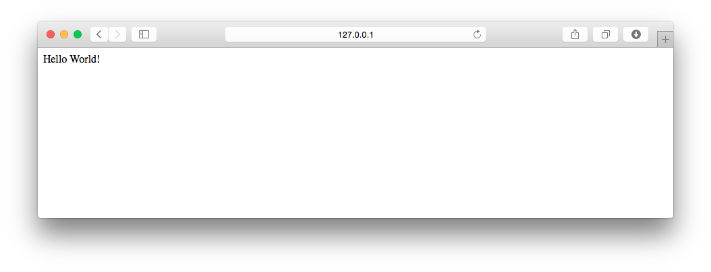

===============================================================================
ビュー関数とURLConfを書こう
===============================================================================

ここからは、画面に「Hello World!」を表示するビュー関数とURLディスパッチャを書きます。

ビュー関数とURLディスパッチャ
===============================================================================

プログラムを書く前に、**ビュー関数** と **URLディスパッチャ** について説明します。

ビュー関数
-------------------------------------------------------------------------------

**ビュー関数** とは、簡単にいえばWebリクエストを引数にとり、 Webレスポンスを返す関数です。

レスポンスはWebページ（HTML）やエラー、jsonドキュメントやPNG・JPEGといった画像など、何でも返す事ができます。

URLディスパッチャ
-------------------------------------------------------------------------------

**URLディスパッチャ** とは「あるURLに対してリクエストが送られた場合、レスポンスを返すビュー関数を指定する」ための設定です。

**URLConf** と呼ばれる設定ファイルに書かれます。URLConfは、一般的にプロジェクトまたはアプリケーションの **urls.py** です。

画面に「Hello World!」を表示するには、次のような手順を踏みます。

- 「Hello World!」というWebレスポンスを返すビュー関数を作る
- URLConf にビュー関数と、ビュー関数を呼び出す設定を書く

ビュー関数を作ろう
===============================================================================

それでは、実際にビュー関数を作りましょう。

**hello** アプリケーションの **views.py** にビュー関数を追加します。このファイルは、アプリケーションを作った時に自動生成されています。

**hello/views.py**

.. code-block:: python
   :linenos:

   from django.http.response import HttpResponse

   def hello_world(request):
       return HttpResponse('Hello World!')

URLディスパッチャを書こう
===============================================================================

プロジェクトが使うURLConfは、

**mysite/settings.py**

の **ROOT_URLCONF** に設定されています。

標準では

**mysite/urls.py**

になっています。このファイルは、Django プロジェクトを作った時に自動生成されています。

標準のURLConf をそのまま編集しても動作しますが、複数のアプリケーションを扱う場合はアプリケーションごとに
URLが設定出来たほうが何かと便利です。

将来を見据えて、アプリケーションごとにURLを設定する方法を採用します。

.. note::

   url関数の第一引数は「正規表現」で書かかれています。

   正規表現についてはPythonの標準ライブラリの1つである「 re 」のドキュメントを参照してください。

   http://docs.python.jp/3.3/library/re.html

**hello** アプリケーションに **urls.py** を作成し、hello_worldビュー関数を呼び出す為の設定を書きます。

**hello/urls.py**

.. code-block:: python
   :linenos:

   from django.conf.urls import url
   from . import views

   urlpatterns = [
       url(r'^$', views.hello_world, name='hello_world'),
   ]

プロジェクトのurls.pyに、先ほど作成した **hello** アプリケーションの **urls.py** を呼び出す設定を追加します。

**mysite/urls.py**

.. code-block:: python
   :linenos:

   from django.conf.urls import include, url

   urlpatterns = [
       url(r'^hello/', include('hello.urls', namespace='hello')),
   ]

以上で、ビュー関数の定義と、URLConfの作成が終わりました。

動作確認をしよう
===============================================================================

実際に動くか確認してみましょう。開発用サーバーを起動します。

.. code-block:: bash

   (venv)$ python mysite/manage.py runserver

ブラウザで http://127.0.0.1:8000/hello/ を開き、Hello World!が表示されていれば成功です。

