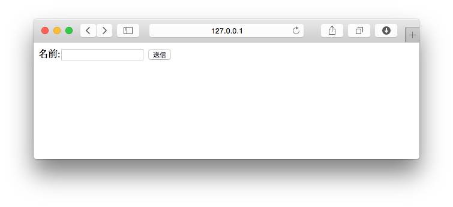
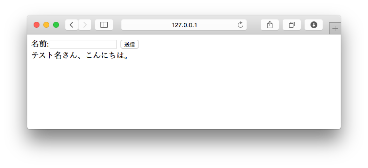

===============================================================================
画面からデータを受け取ろう
===============================================================================

ショッピングサイトでアカウントを作る場合は、画面から氏名や住所などの情報が入力されます。これらを適切に処理できなければWebアプリケーションとして成り立ちません。

ここでは、画面上から入力されたデータをDjangoで扱う方法を学んでいきます。

Webフォームを作ろう
===============================================================================

入力項目や、入力されたデータをウェブリクエストとして受け取るには<form>タグを利用します。

ウェブリクエストについては、ビュー関数について説明した時に登場していますが、

**templates** フォルダーに **get_query.html** ファイルを作成します。

**templates/get_query.html**

.. code-block:: html

    

    
        <form action="" method="get">
            <label>名前:<input type="text" size="20" name="your_name"></label>
            <input type="submit" value="送信">
        </form>
        
            {{ your_name }}さん、こんにちは。
        
    

ビュー関数で、画面から入力したデータを扱おう
===============================================================================

.. note::

   ビュー関数を作る前に、少しおさらいをしましょう。

   **Hello World! を表示しよう** でビュー関数について以下のように説明しました。

   **「ビュー関数 とは、簡単にいえばウェブリクエストを引数にとり、 ウェブレスポンスを返す関数です。」**

   つまり **ウェブリクエストとはビュー関数の第一引数** です。

   引数名は、慣習でrequestとしています。

画面に入力されたデータは、ウェブリクエストに格納されています。
<form>タグのmethodに応じて、ウェブリクエストで扱う変数も変わります。
よく使う組み合わせは次の通りです。

.. list-table::
   :header-rows: 1

   * - HTTP Method
     - QueryObject
   * - get
     - request.GET
   * - post
     - request.POST

今回は<form>タグのmethodに **"get"** を指定したので、 **request.GET** からデータを取得できます。

それでは、実際にウェブリクエストを扱うビュー関数を作ってみましょう。

**hello/views.py**

.. code-block:: python

    def hello_get_query(request):
        d = {
            'your_name': request.GET.get('your_name')
        }
        return render(request, 'get_query.html', d)

作成したビュー関数を呼び出すため、URLディスパッチャを書きましょう。

**hello/urls.py**

.. code-block:: python

    from django.conf.urls import url
    from . import views

    urlpatterns = [
        url(r'^$', views.hello_world, name='hello_world'),
        url(r'^template/$', views.hello_template, name='hello_template'),
        url(r'^if/$', views.hello_if, name='hello_if'),
        url(r'^for/$', views.hello_for, name='hello_for'),
        url(r'^get/$', views.hello_get_query, name='hello_get_query'), # 追加する
    ]

http://127.0.0.1:8000/hello/get/ を表示してみましょう。

正常に表示されたら、以下のデータを入力して [送信] ボタンを押下してみましょう。

:名前: テスト名

ウェブリクエストを正常に処理できると、次のような表示になります。

HTTP Methodの使い分けについて
===============================================================================

今回は、画面から入力されたデータをget methodで受け取りました。

一般的にget methodとpost methodは次のように使い分けます。

.. list-table::
   :widths: 5 20
   :header-rows: 1

   * - HTTP Method
     - 用途
   * - get
     - 検索や表示の切替など、永続化されたデータに影響を与えない処理を行う場合
   * - post
     - 登録・更新など、永続化されたデータに影響を与える処理を行う場合

HTTP Methodにはputやdeleteなども存在しますが、postで代用する事が少なくありません。

.. note::

   HTTP Method を含め、重要な基礎知識の多くは `Webを支える技術 <http://gihyo.jp/magazine/wdpress/plus/978-4-7741-4204-3>`_ （技術評論社） に詳しい説明が載っています。
